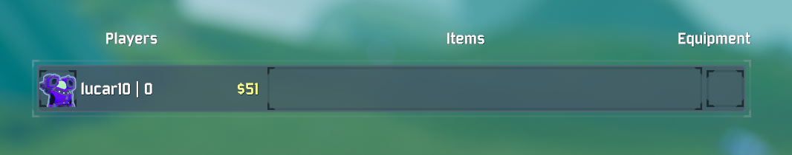
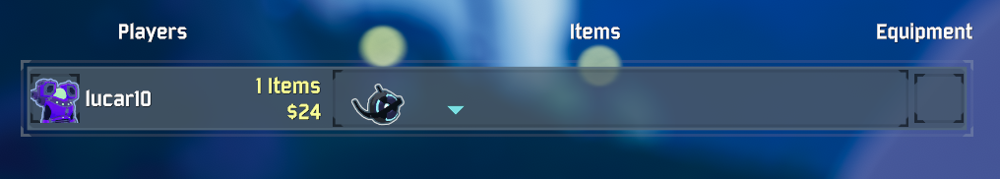
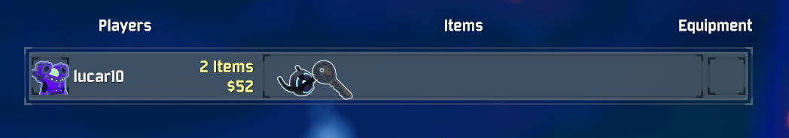

# TotalItemCount

Provides the total item count of each player in the TAB overlay (Scoreboard).

The item count is displayed just above the amount of money gathered.





## Installation

Install via the Thunderstore page with r2modman. Requires BepInEx pack.

## Building

TODO - not all of these are necessary, but they're what we copied over to `libs/` initially.

We use the DLLs from BepInEx pack:
- `core`
- `monomod`
- `patchers`
- `plugins/tristanmcpherson-R2API`

And from RoR2's `Managed` DLLs:
- `UnityEngine.dll`
- `Unity.TestMeshPro.dll`
- `UnityEngine.Networking.dll`
- `UnityEngine.CoreModule.dll`
- `Assemply-CSharp.dll`

Required DLLs can be copied into `libs/`.

The project is built with .NET 3.1.x:

```
dotnet restore
dotnet msbuild
```