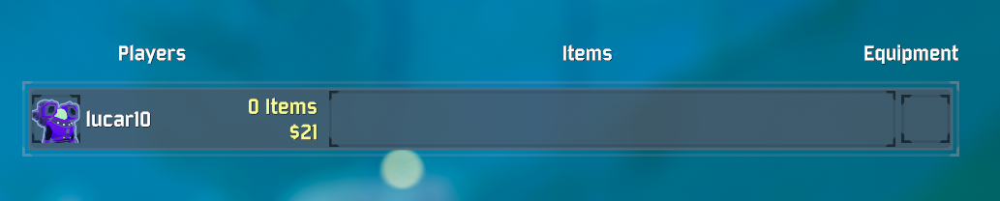

# TotalItemCount

Provides the total item count of each player in the TAB overlay (Scoreboard).

The count is currently displayed just after the player name, but we are working on customizing its position (e.g. placing it next to the money gathered).




## Installation

Install via the Thunderstore page with r2modman. Requires BepInEx pack.

## Building

We use the DLLs from BepInEx pack:
- `core`
- `monomod`
- `patchers`
- `plugins/tristanmcpherson-R2API`

And from RoR2's `Managed` DLLs:
- `UnityEngine.dll`
- `Unity.TestMeshPro.dll`
- `UnityEngine.Networking.dll`
- `UnityEngine.CoreModule.dll`
- `Assemply-CSharp.dll`

Required DLLs can be copied into `libs/`.

The project is built with .NET 3.1.x:

```
dotnet restore
dotnet msbuild
```